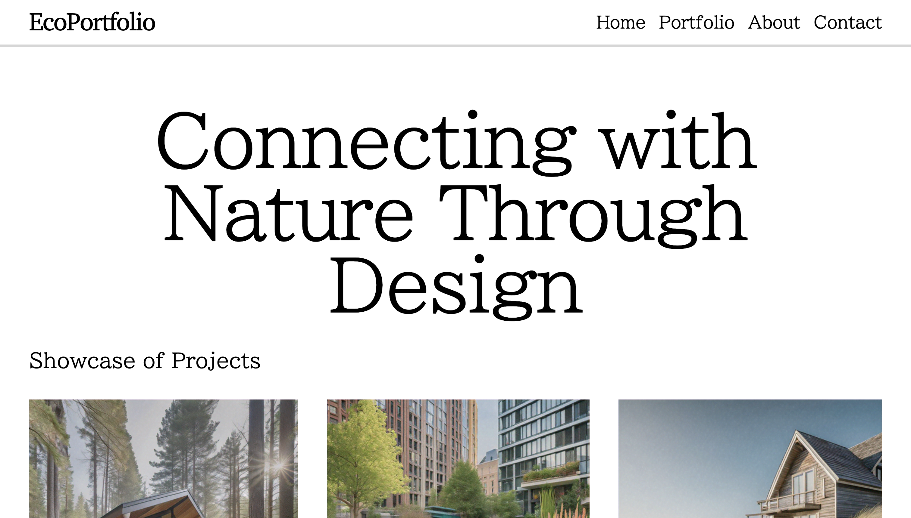

# 🌐 Modern Responsive Landing Page

> A clean and responsive landing page built using pure HTML and CSS with a focus on modern UI design and user experience.

🔗 **Live Demo:** https://capstone-kappa-ebon.vercel.app/

---

## 📌 Overview

This project is a modern static landing page developed using **HTML5 and CSS3**.
It showcases the ability to build a visually appealing and responsive interface without using any frameworks or JavaScript.

The design focuses on simplicity, consistency, and a smooth user experience across all screen sizes.

---

## ✨ Features

* 📱 Fully responsive (mobile, tablet, desktop)
* 🎨 Clean and modern UI design
* 🧩 Semantic and structured HTML layout
* ⚡ Lightweight and fast-loading
* 📐 Consistent spacing and typography
* 🖼️ Well-organized project structure

---

## 🛠️ Tech Stack

* **HTML5**
* **CSS3**
* **Vercel** (Deployment)

---

## 📂 Project Structure

```
project/
│── index.html
│── css/
│   └── style.css
│── assets/
│   └── images/
│── README.md
```

---

## 📸 Screenshots




---

## 🎯 Learning Outcomes

* Writing clean and semantic HTML
* Building responsive layouts using CSS
* Structuring a professional front-end project
* Applying modern UI/UX design principles
* Improving attention to layout and consistency

---

## 🚀 Future Improvements

* Add JavaScript for interactivity
* Improve animations and transitions
* Enhance accessibility (ARIA, contrast, etc.)
* Expand into a multi-page website

---

## 👨‍💻 Author

**Kaavya Gala**

---

## 📜 License

Open for learning and personal use.
